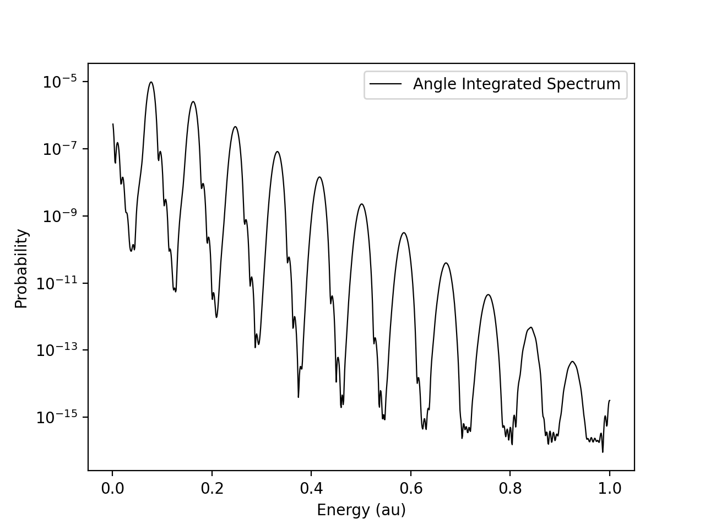
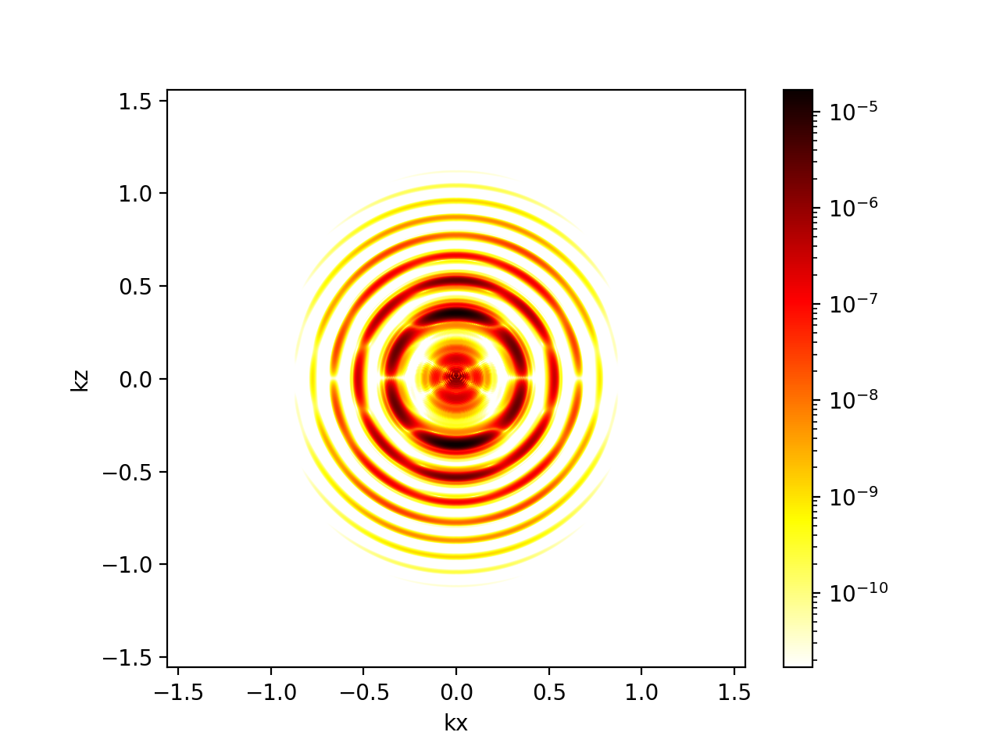

# AMO-TDSE

## What is this?

AMO-TDSE is a Time-Independent and Time-Dependent Schrodinger Equation solver I wrote for my graduate research at JILA. The purpose of the simulation is to model how atoms interact with ultrashort, intense laser pulses and study the phenomena that occurs as a result of that interaction. The simulation is broken into three main steps:

The simulation is broken into three main steps:
1. Solve the TISE to get the bound states for an atom.
2. Solve the TDSE for a laser interacting with the atom, using a bound state as the initial condition.
3. Analyze the final state after the TDSE to study phenomena (Ionization, Excited State Populations etc)

## How does it work?

The simulation relies on PETSc and SLEPc for sparse, parallelized linear algebra in two key places: Solving an eigenvalue problem for the bound states (SLEPc) and solving a linear system to propagate the wavefunction in time (PETSc). This allows the problems to be solved much faster, for example, on a HPC cluster such as the one I used at the university. 

## Numerical Techniques

There are a few numerical techniques that were employed that make this code stand out from other similar projects one can find online. In general, here are at least two concessions that must be made when solving the Schrodinger Equation numerically. The first is that we cannot use an infinite number of basis functions to perfectly represent our wavefunction, and we cannot use an infinitly large spacial grid. The first two techniques listed below address each of these issues.

### BSpline Basis Functions

When dealing with the radial coordinate a natural representation is the finite difference basis. This basis effectively represents your radial coordinate with a discrete set of position eigenstates (usually with a fixed step size). There are a few downsides to this:

1. For atoms whose potential wells are deeper than Hydrogen, the bound states oscillate more quickly near the core. These rapid oscillations make accurate representation more difficult compared to Hydrogen, requiring more grid points in that region in order to converge the correct eigenvalues/eigenvectors.

2. Compounding with the last point, most finite difference schemes assume a fixed spacial step size. The problem with this is that while we may need a 10x smaller step size near the core to converge the eigenvalue problem, we are then forced to use the smaller step size everywhere. This dramatically increases dimensionality, that increased resolution is wasted in regions where it's not required. While where are some finite difference schemes for varying step size, they are more difficult to implement and manage. 

A BSpline basis addresses this in two ways. First, by adjusting the knot vector it becomes trivial to increase the density of BSPlines in a particular region. In fact, you have full control of how these basis functions are distributed. For example,you can have quadratically increasing spacing as you get further from the core, which transitions to a constant linear spacing at some sufficient distance, providing high resolution where needed and not wasting dimensionality where it is not. Second, with a BSpline basis you effectively trade sparsity for dimensionality. This is because a BSpline basis function is able to represent more structure than a position eigenstate (which in position space is a dirac delta). So you need far less of them to accurately represent your wavefunction. 

### Exterior Complex Scaling

Because we cannot simulate using an infinitely large spacial grid, a choice must be made of how large of a finite grid we should use. What we want to avoid then is the wavefunction hitting the boundary, causing unphysical reflections back towards the atom. There are many techniques that seek to address this issue. For example there are masking functions, where at each time step of the evolution the wavefunction past some cutoff distance is multiplied by a damping parameter to smoothly force it to zero. Another is the addition of complex absorbing potentials, which bake in suppression of the wavefunction past some distance into the time propagation. These have their drawbacks however, such as (smaller) reflections occuring at the cutoff point, or being unable to prevent reflections in time for sufficiently high energy wavepackets. 

The best solution that I am aware of to address both of these issues is Exterior Complex Scaling. Exterior complex scaling rotates the position coordinate into the complex plane past some cutoff position. While the details are too lengthy to include here, the result is that you get perfect absorption with no spurious reflections from the cutoff position, and it adaptively suppresses based on wavepacket energy, preventing even the highest energy wavepackets from reaching the boundary. The implementation is also remarkably simple when using a BSpline basis making this approach even more attractive. 

## Observables

The code supports various observables of interest. Examples include angle-resolved as well as angle-integrated photoelectron spectra, microscopic high harmonic generation, and bound state populations. Example of each are plotted below, and the input file used to achieve these results is included in the examples directory. 

### Photoelectron Spectra

#### Linear Polarization

|  |  |
|-----------------------------------|-----------------------------------|

## Dependencies and Installation

### Dependencies
- **Spack:** Version 1.0.0
- **CMake:** Version 3.14 
- **PETSc:** Version 3.22.2 
- **SLEPc:** Version 3.22.2
- **GSL:** Version 2.8
- **Nlohmann Json:**  Version 3.11.3
-  **Matplotlib:**  Version 3.10.1
-  **Python:** Version 3.13.2
-  

- ### Installation

This simulation was built with HPC environments in mind. As such when developing, testing, and running the simulation I found the package manager Spack the simplest and easiest way to get a PETSC/SLEPc build up and running. 

#### Step 1: Install Spack 

```
git clone https://github.com/spack/spack.git
cd spack
source share/spack/setup-env.sh
```

#### Step 2: Create and acivate environment

```
spack env create my-env
spack env activate my-env
```

#### Step 3: Add packages to environment

```
spack add petsc \
    clanguage=C++ \
    +complex \
    +double \
    +hdf5 \
    +hypre \
    +metis \
    +mpi \
    +mumps \
    +superlu-dist \
    +scalapack \
    +openmp \
    +strumpack \
    +shared

spack add slepc \
	+arpack

spack add cmake

spack add nlohmann-json

spack add gsl

spack add python

spack install py-matplotlib

```

#### Step 4: Concretize and install 

```
spack concretize

spack install
```


